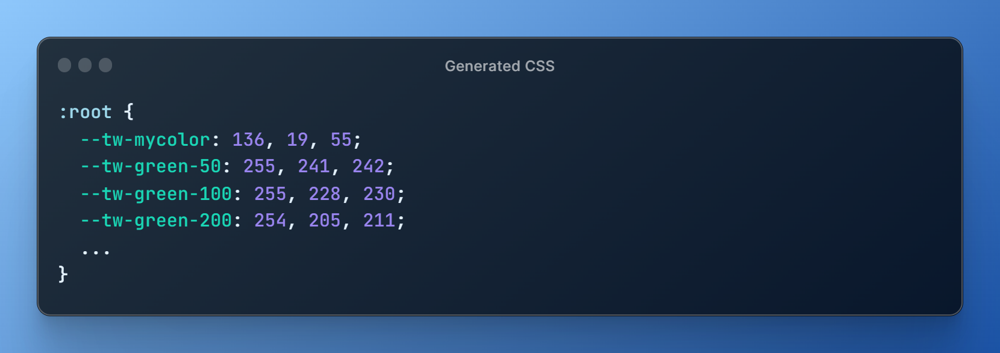

<p align="center">
  <picture>
    <source media="(prefers-color-scheme: dark)" srcset=".github/logo-dark.svg">
    <source media="(prefers-color-scheme: light)" srcset=".github/logo-light.svg">
    
  </picture>
  <p align="center">
    <a href="https://tailwindcss.com/">v3.0.0-blue" alt="Required version"></a>
    <a href="https://github.com/georgecht/tailwindcss-expose-colors/releases"></a>
    <a href="https://github.com/georgecht/tailwindcss-expose-colors/blob/main/LICENSE"></a>
  </p>
  <h1 align="center">@tailwind-plugin/expose-colors</h1>
</p>

<br>



## Introduction

This is a pretty much straighforward Tailwind plugin that allows you to expose Tailwind's colors and their shades, including any custom ones included in your own theme, as custom CSS properties on the :root element. This can be useful for maintaining a consistent color theme across your project and easily accessing Tailwind colors in your stylesheets.

## Requirements

This plugin is built upon [TailwindCSS](https://github.com/tailwindlabs/tailwindcss/releases/latest). Therefore, TailwindCSS v3.0.0 is at least required. Get started [here](https://tailwindcss.com/docs/installation).

It's also recommended that you have a basic understanding of CSS and how to install Tailwind plugins. Learn more about Tailwind plugins [here](https://tailwindcss.com/docs/plugins).

## Install

Install the plugin from npm:

```
npm i -D @tailwind-plugin/expose-colors
```

Then add the plugin to your tailwind.config.js file:

```ts
/** @type {import('tailwindcss').Config} */
module.exports = {
  theme: {
    // ...
  },
  plugins: [
    require('@tailwind-plugin/expose-colors'),
    // ...
  ],
}
```

## Usage options

### `extract`

| Option    | Type              | Default | Description                                                                                                           |
| --------- | ----------------- | ------- | --------------------------------------------------------------------------------------------------------------------- |
| `extract` | `string \| Array` | `'all'` | Specify the color keys as an array to extract. Use 'all' to extract all colors or provide an array of all color keys. |

📌 You can extract colors from [Tailwind's default color palette](https://tailwindcss.com/docs/customizing-colors), or your custom ones declared in your theme.

⚠️ Exposing `'all'` Tailwind's colors, will increase the filesize of your bundled CSS file by _7.76 kB_

#### Example:

```ts
/** @type {import('tailwindcss').Config} */
module.exports = {
  theme: {
    colors: {
      // your custom colors
      midnight: '#121063',
      tahiti: {
        100: '#cffafe',
        200: '#a5f3fc',
        300: '#67e8f9',
        // ...
      },
    },
    // ...
  },
  plugins: [
    require('@tailwind-plugin/expose-colors')({
      extract: ['yellow', 'blue', 'midnight', 'tahiti'],
    }),
    // ...
  ],
}
```

#### Exposed colors:

```css
  ::root {
    --tw-yellow-50: #FEFCE8;
    --tw-yellow-100: #FEF9C3;
    --tw-yellow-200: #FEF08A;
    ...
    --tw-midnight: #121063;
    --tw-tahiti-100: #CFFAFE;
    --tw-tahiti-200: #A5F3FC;
    --tw-tahiti-300: #67E8F9;
    ...
  }
```

### `prefix`

| Option   | Type     | Default | Description                                                         |
| -------- | -------- | ------- | ------------------------------------------------------------------- |
| `prefix` | `string` | `--tw`  | Customize the prefix for CSS variables. The default prefix is --tw. |

#### Example:

```ts
/** @type {import('tailwindcss').Config} */
module.exports = {
  // ...
  plugins: [
    require('@tailwind-plugin/expose-colors')({
      prefix: '--color',
    }),
  ],
}
```

#### Exposed colors:

```css
  ::root {
    --color-midnight: #121063;
    --color-tahiti-100: #CFFAFE;
    --color-tahiti-200: #A5F3FC;
    --color-tahiti-300: #67E8F9;
    ...
  }
```

### `mode`

| Option | Type             | Default | Description                                                                                           |
| ------ | ---------------- | ------- | ----------------------------------------------------------------------------------------------------- |
| `mode` | `'hex' \| 'rgb'` | `hex`   | Choose the color mode for extracted colors. Use 'hex' for hexadecimal colors or 'rgb' for RGB colors. |

#### Example:

```ts
/** @type {import('tailwindcss').Config} */
module.exports = {
  // ...
  plugins: [
    require('@tailwind-plugin/expose-colors')({
      mode: 'rgb',
    }),
  ],
}
```

#### Exposed colors:

```css
  ::root {
    --tw-midnight: 18, 16, 99;
    --tw-tahiti-100: 207, 250, 254;
    --tw-tahiti-200: 165, 243, 252;
    --tw-tahiti-300: 103, 232, 249;
    ...
  }
```

The exposed variable colors will be in `'rgb'` format so you can use them like so:

```css
.myclass {
  background: rgba(var(--tw-tahiti-500), 0.8);
}
```

## Authors

Based on Merott Movahedi's and Rafael R. Camargo's snippet. Developed, modified and maintained by [George Cht](https://github.com/GeorgeCht).

- George Cht ([@GeorgeCht](https://github.com/GeorgeCht))
- Merott Movahedi ([@Merott](https://github.com/Merott))
- Rafael R. Camargo ([@rafaelrcamargo](https://github.com/rafaelrcamargo))

## License

[MIT License](https://opensource.org/licenses/MIT)
